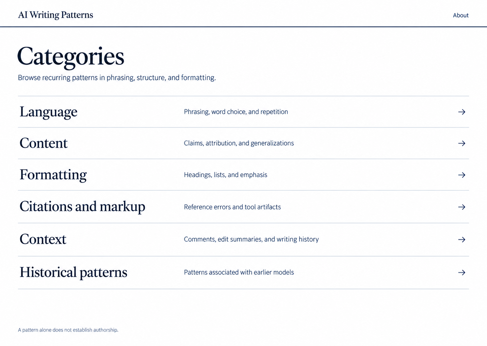
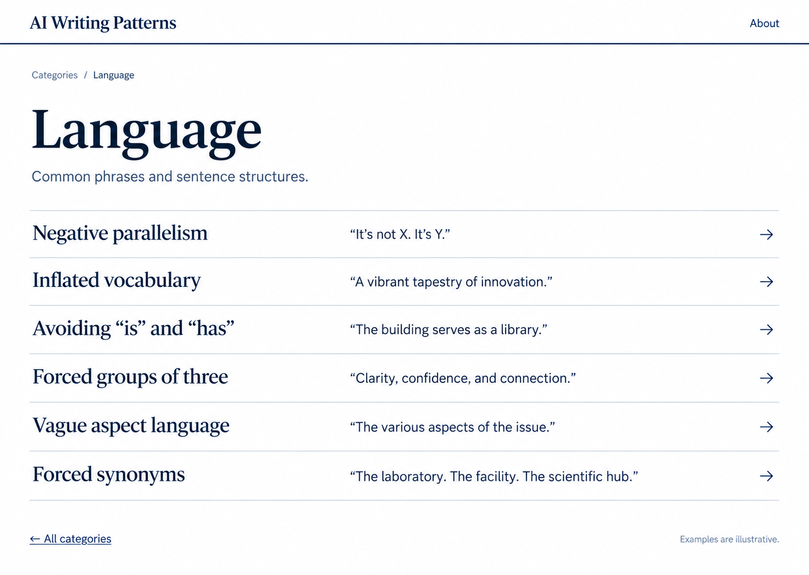
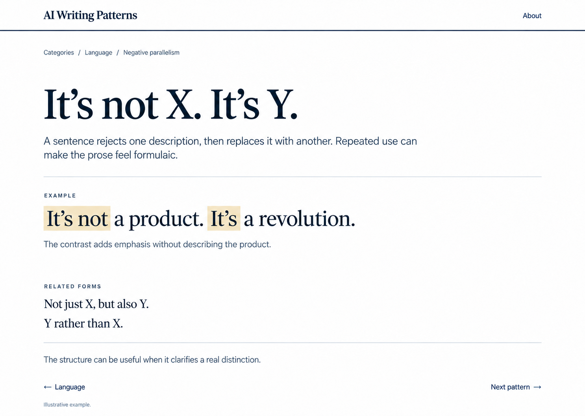

# AI Writing Patterns

## Screen designs for approval

The proposed site lets a visitor choose a category, open a pattern, and view an example. It is intended for client presentations and students. The three revised images below restore the original navy and white palette while retaining the simplified category browser. They supersede the earlier mockups.

### Categories

Each category is a full-width link. The home screen has no promotional headline or course controls. Categories group the content into Language, Content, Formatting, Citations and markup, Context, and Historical patterns.

### Patterns in a category

Each row links to a pattern and shows a short example. Negative parallelism opens the example screen below. Back navigation returns to the category index.

### Pattern and example

The page contains the pattern, a short description, an example, and a relevant qualification. Related forms can link to their own examples. Previous and next navigation stays within the selected category.

## Presentation details

White background, deep navy (#051c2c) headings and navigation, slate supporting text, and a navy masthead rule. Serif headings and sans-serif interface text. Thin rules separate rows. Highlighting is reserved for the relevant words in an example. Use one consistent masthead, content width, and type scale when implementing; the images are visual targets rather than final browser renders.

The approved build should use the first screen's masthead alignment consistently. The category description can be shortened to “Browse by category.” Remove unnecessary interface copy rather than filling empty space. Standardize “Inflated vocabulary” to “Repeated stock vocabulary” so the label describes recurrence without implying that every formal word is defective.

The interface should use descriptive labels and short factual explanations. Stock rhetorical constructions belong only in clearly marked examples. There is no source-notes sidebar. Source attribution and license information belong on the About page and in the accompanying reference document.

Historical material remains labeled as historical. The Context category includes a clearly separate page on ineffective indicators and alternative explanations. Those items must not be displayed as positive evidence of AI authorship. The expanded 138-entry catalog includes subtypes and interpretive context; the site should not advertise it as 138 independent tells. These mockups predate the expanded catalog; navigation counts will need updating during implementation.

On narrow screens, descriptions stack below pattern names and rows remain easy to tap. Links should work with keyboard navigation, have visible focus, and retain sufficient contrast. Highlighted phrases must remain understandable without color.

## Scope after approval

Build the category browser with all catalog content, direct links to individual patterns, working back and next navigation, and an About page with attribution. Provide a Windows launcher that starts the local site and opens it in the user's browser. Keep the content available locally for presentations. No quiz, course progress, account system, or authorship score is part of this design.

These are static screen designs. The application and launcher have not been built. Approval is requested for the revised screens and the Word and Markdown reference before implementation.

## Reference files

- [Word reference](../references/AI-Writing-Signs-and-Rules.docx)
- [Markdown reference](../../content/ai-writing-signs-and-rules.md)

The screens are visual mockups. Local generation prompts and superseded designs are excluded from this repository.
